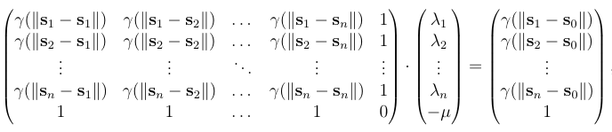

# geoFourierFDA

In this paper, we have observsed \(n\) curves
\(\chi_{\mathbf{s}_1}(t), \dots, \chi_{\mathbf{s}_n}(t)\) in a region,
where \(\mathbf{s}_i=(\theta_i, \eta_i), i=1, \dots, n\), and
\(\theta_i\) is the latitude and \(\eta_i\) is the longitude where the
curve \(\chi_{\mathbf{s}_i}\) was sampled. The goal of this package is
to estimate an unsampled curve \(\chi_{\mathbf{s}_0}(t)\) at
\(\mathbf{s}_0 \not \in \{\mathbf{s}_1, \dots, \mathbf{s}_n\}\). The
Ideia proposed by [Giraldo
(2011)](https://doi.org/10.1007/s10651-010-0143-y) was simple: the curve
\(\chi_{\mathbf{s}_0}(t)\) is a linear combination of all curves
\(\chi_{\mathbf{s}_1}(t), \dots, \chi_{\mathbf{s}_n}(t)\), i.e.,
\(\widehat{\chi_{\mathbf{s}_0}}(t) = \lambda_1 \chi_{\mathbf{s}_1}(t) + \lambda_2 \chi_{\mathbf{s}_2}(t) + \dots + \lambda_n \chi_{\mathbf{s}_1}(t)\)
where \(\lambda_1, \dots, \lambda_n\) is solution of the linear system
given by



where \(\mu\) is an constant from the method of Lagrange’s multipliers
and the function \(\gamma(h)= \int \gamma(h;t)dt\) is called the
trace-variogram, where, for each \(t\), \(\gamma(h; t)\) is the
semivariogram for the process
\(\chi_{\mathbf{s}_1}(t), \dots, \chi_{\mathbf{s}_n}(t)\). More
precisely, for each \(t\), a weakly and isotropic spatial process is
assumed for \(\chi_{\mathbf{s}_1}(t), \dots, \chi_{\mathbf{s}_n}(t)\)
and the integration of the semivariogram is carried out. Usually, the
integration in the equation (1) is approximated using a modified version
of the empirical semivariogram. In this pcackage, we have used the
Legendre-Gauss quadrature, which is simple and it explicitly used the
definition of the semivariogram.

## Installation

This package can be installed using the `devtools` package.

``` r
devtools::install_github("gilberto-sassi/geoFourierFDA")
```

## Examples

In this package, we have used the temperature dataset present in the
package [`fda`](https://CRAN.R-project.org/package=fda) and in the
package [`geofd`](https://CRAN.R-project.org/package=geofd). This
dataset has temperature measurements from \(35\) weather stations from
Canada. This data can be downloaded at
[weather.gov.ca](https://weather.gc.ca). For illustration, we have
separated the time series at *The Pas* station and used all others
stations to estimate the curve temperature at *The Pas*.

### How to interpolate a curve at an unmonitored location

``` r
# interpolating curve at Halifax using all remaining curves in the functional dataset
data(canada)

# Estimating the temperature at The Pas
geo_fda(canada$m_data, canada$m_coord, canada$ThePas_coord)
```

### Coefficients of smoothing using Fourier series polynomial

``` r
# Coefficients of smoothing using Fourier series polynomial
# Coefficients of smoothing at The Pas
data(canada)

coefs <- coef_fourier(canada$ThePas_ts)
```

### Smoothed curve using Fourier series

``` r
# Coefficients of smoothing using Fourier series polynomial
# Coefficients of smoothing at The Pas
data(canada)


# coefficients of Fourier series polynomial
coefs <- coef_fourier(canada$ThePas_ts, m)

# points to evaluate curve at interval [-pi, pi]
x <- seq(from = -pi, to = pi, by = 0.01)

# smoothed curve at some points x
y_est <- fourier_b(coefs, x)
```

## References

Giraldo, R, P Delicado, and J Mateu. 2011. “Ordinary Kriging for
Function-Valued Spatial Data.” *Environmental and Ecological Statistics*
18 (3): 411–26.

<script type="text/javascript" id="MathJax-script" 
  src="https://cdn.jsdelivr.net/npm/mathjax@3/es5/tex-mml-chtml.js">
</script>

